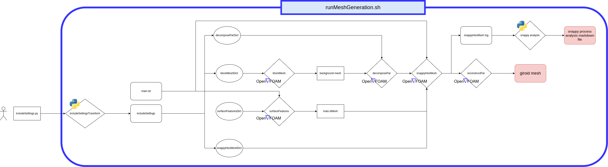

# directorio de generación de malla de esponja de giroide
### example of `includeSettingsSnappyBase.py`
```python
# NUMBER OF PROCESSOR TO USE
nProcs = 8

# CELL LENGTH
cell_length = 0.15

# SCALING OF main.stl
scaleOnOff = 'off' # on/off
scale = 0.1

# snappyHexMeshDict SETTINGS
level_eMesh = 1
level_min_refinementSurfaces = 0
level_max_refinementSurfaces = 0
level_refinementRegion = 0
snapControls_tolerance = 1

# CORNERS OF blockMeshDict
# ES IMPORANTE PONER LAS ESQUINAS EN EL ORDEN QUE CORRESPONDE
# VER https://www.openfoam.com/documentation/user-guide/4-mesh-generation-and-conversion/4.3-mesh-generation-with-the-blockmesh-utility
```

### flowsheet


### inputs
> los inputs son cargados en el archivo **includeSettingsSnappy.py**, definiendo las variables como se definen en python

inputs a proveer:
-  número de procesadores a utilizar
    - usado por decomposePar para desconponer el dominio en la cantidad de subdominios especificados
    - usado por snappyHexMesh para correr los subdominios en paralelo
- puntos para malla de fondo
    - usado por blockMesh para armar la malla de fondo
- punto interno del giroide
    - usado por snappyHexMesh para determinar cuál es la malla a refinar/snappear
- opciones de scale
    - usado por surfaceConvert para escalar (o no escalar) el archivo main.stl
- longitud de celda
    - usado por el blockMesh para hacer la malla de fondo con celdas cubicas

### outputs
- malla de giroide
    - visualizable en [Paraview](https://www.paraview.org/) abriendo archivo **mesh.foam**.
- analisis del proceso de mallado de snappy --> **snappyAnalysis.md**
    - para hacerlo hay que correr `scripts/snappyRefinementSampling.py`
    - incluye
        - información de máximos de celdas, caras y puntos
        - graficos de evalución de celdas, caras y puntos en el paso de las iteraciones
            - cells.png, faces.png, points.png
